# 🛍️ OnlineShopUniPi

**OnlineShopUniPi** is a web-based marketplace application inspired by Vinted, where users can list, sell, and purchase products (mainly clothing).  
It was developed as part of the **Information Systems on the Internet** course at the University of Piraeus.

---

## 📖 Project Description

The application provides a functional **online marketplace** with the following features:

- 👤 **User Management**  
  - Registration & Login  
  - Roles: **Guest, User, Admin**  
  - Profile editing & password change  
  - Admin: create, edit, delete users  

- 💖 **Favorites**  
  - Save products into a personal list  
  - View and remove from favorites  

- 🛒 **Marketplace Features**  
  - Product listing, editing, and deletion  
  - Shopping cart functionality  
  - Order handling and checkout process  

- 📦 **Order Management**  
  - Track orders by status (*Processing, Completed, Cancelled*)  

- 🔑 **Admin Panel**  
  - Manage users, orders, and products  

- 🤖 **Recommendation Algorithm**  
  - Suggests products based on purchases and favorites

---

## 🎯 Recommendation System

The application includes a **personalized recommendation system** that suggests products to users based on their history and preferences.

### 🔎 How it works

- **User history based**:
  - Products the user has purchased → strongly increase the weight of those categories.
  - Products the user has added to favorites → slightly increase the weight.

- **Takes into account user filters**: gender, size, category, and price range.

- **Computes a score for each product**:
  - Category match with purchase history ×3
  - Category match with favorites ×1
  - Matches selected category filter +2
  - Matches selected size +1
  - Matches selected gender +3
  - Matches price range +1.2 (or smaller bonus if close to range)

- **Excludes** products already purchased or already in favorites.

- **Selects the top 5** products with the highest score.

- **Fallback logic**:
  - If fewer than 5 results, it adds products from favorites.
  - If still fewer, it fills the list with random products.

This approach ensures that recommendations are **personalized, explainable, and always available**, even when user history is limited.

---

## ⚙️ Core Functionalities

- ASP.NET Core MVC with **Entity Framework Core**  
- Role-based Access Control (RBAC)  
- Secure authentication and session management  
- CRUD operations for users & products  
- Shopping cart & checkout workflow  
- Personalized recommendation engine  

---

## 🛠️ Tech Stack

- **Framework:** ASP.NET Core MVC (.NET 8), C#
- **Frontend:** Razor Views, HTML, CSS, JavaScript, Bootstrap
- **Database:** Microsoft SQL Server
- **ORM:** Entity Framework Core 9
- **Authentication:** Cookie authentication with role-based authorization
- **IDE:** Visual Studio

---
## 🗄️ Database

The project uses **Microsoft SQL Server** as the database engine and was managed through **Microsoft SQL Server Management Studio (SSMS)**.  

### 📊 Database Schema

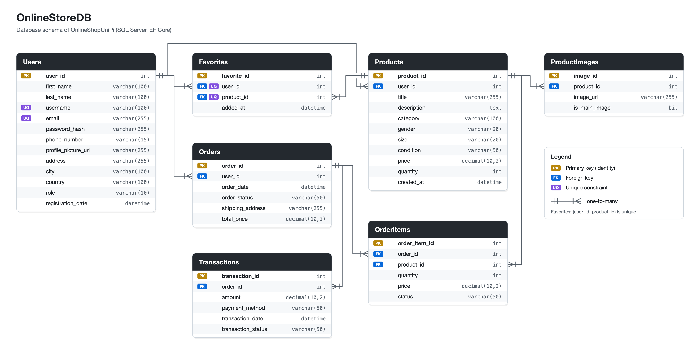

---

## 📸 Screenshots

### 👤 Guest User

<p align="center">
  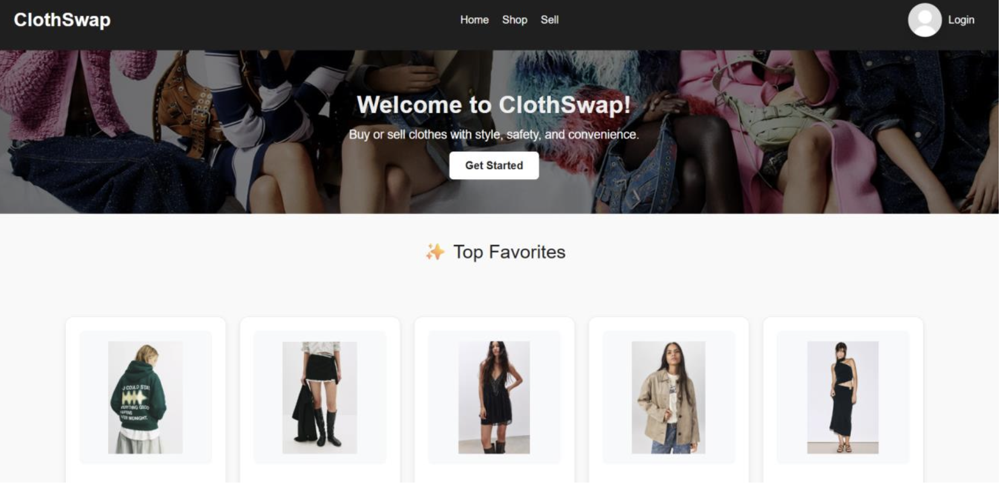
  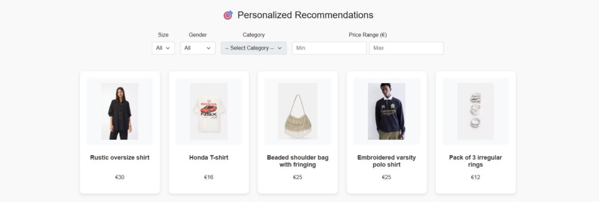
</p>

---

### 🔑 Logged-in User

<p align="center">
  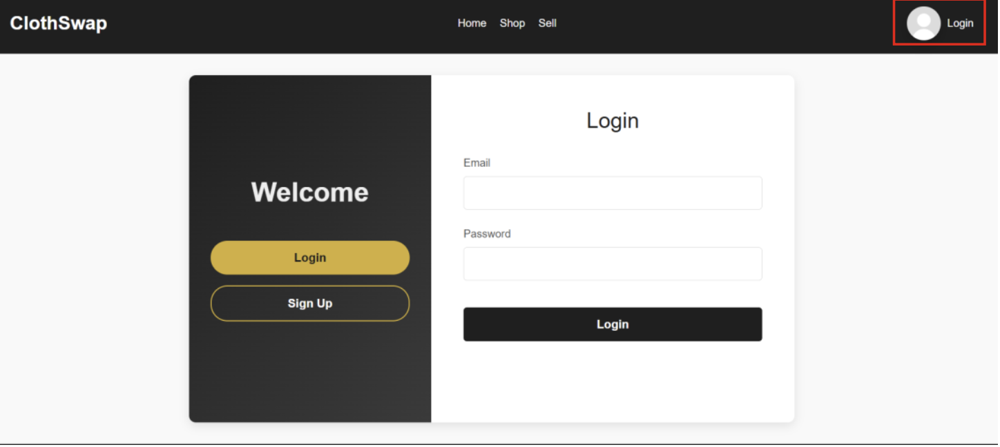
  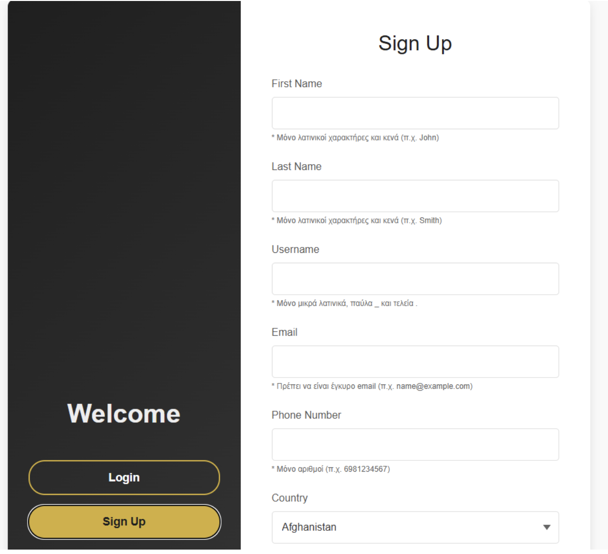
  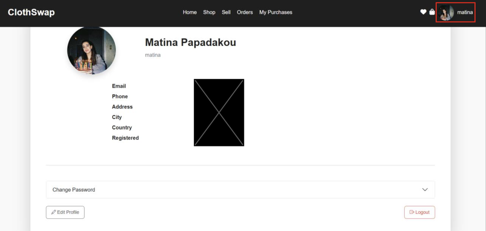
</p>

<p align="center">
  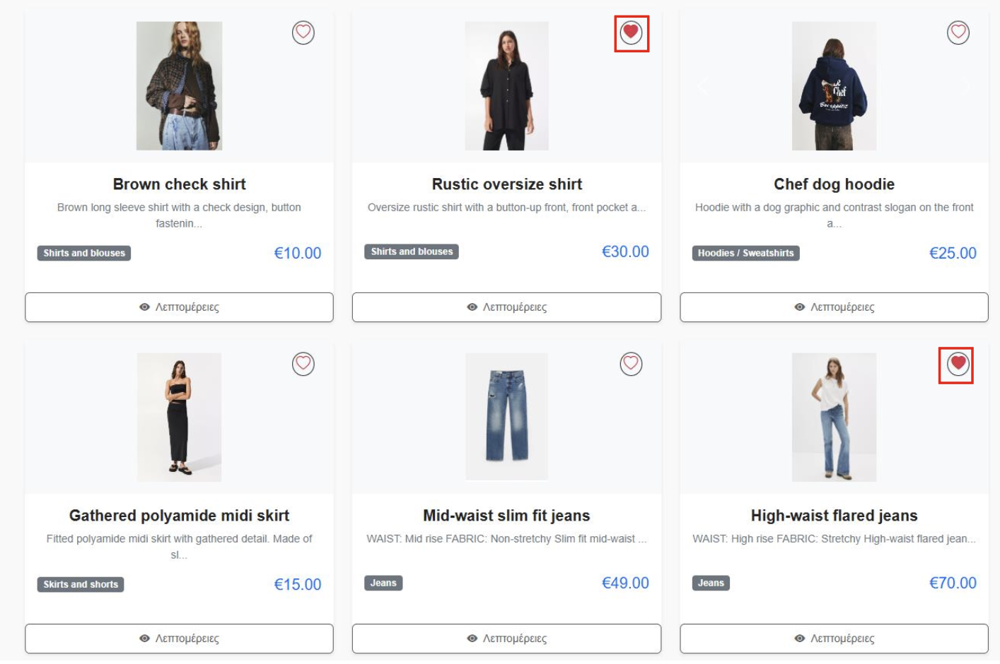
  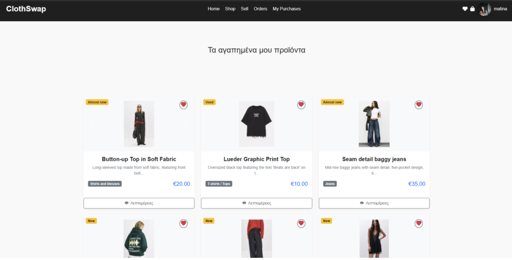
  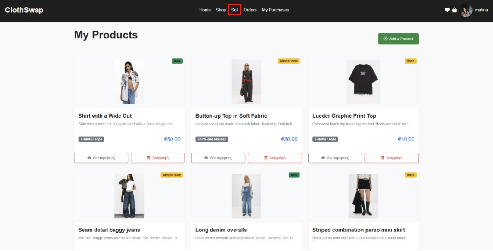
</p>

<p align="center">
  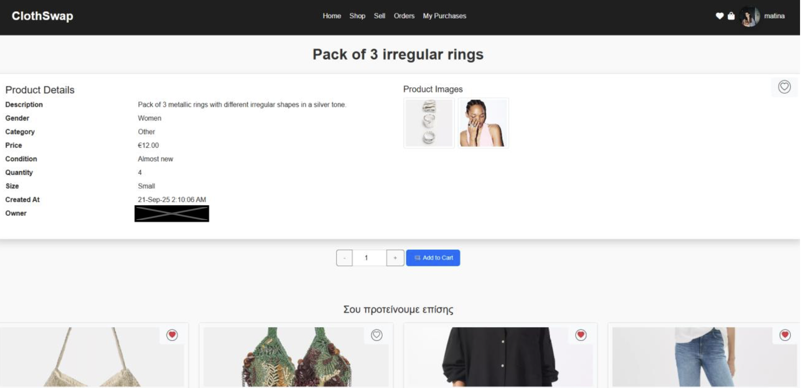
  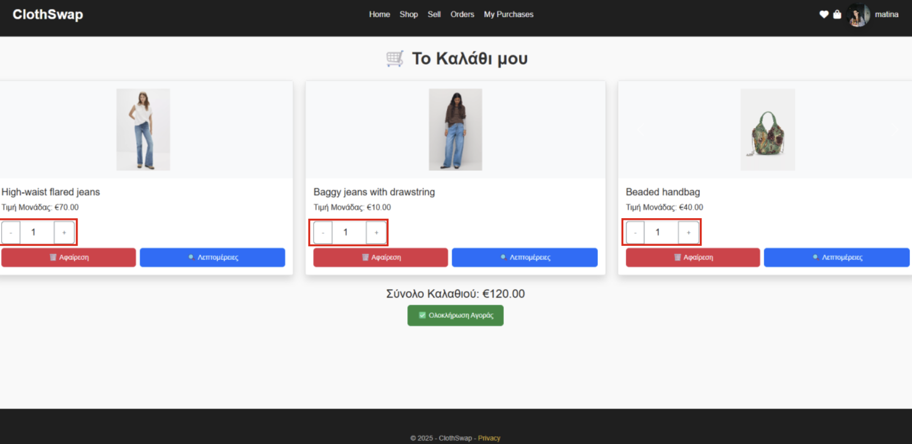
  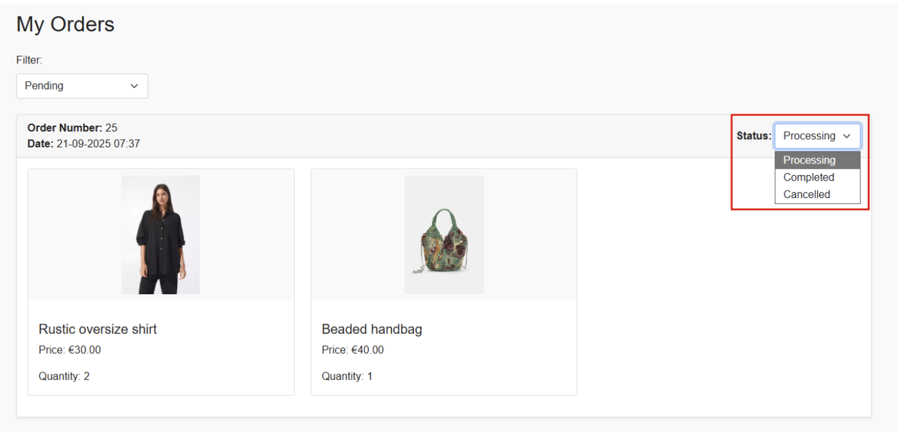
</p>

---

### 🛠️ Admin

<p align="center">
  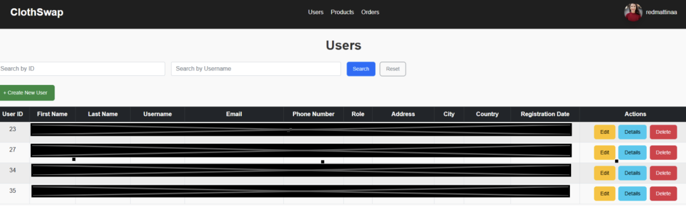
  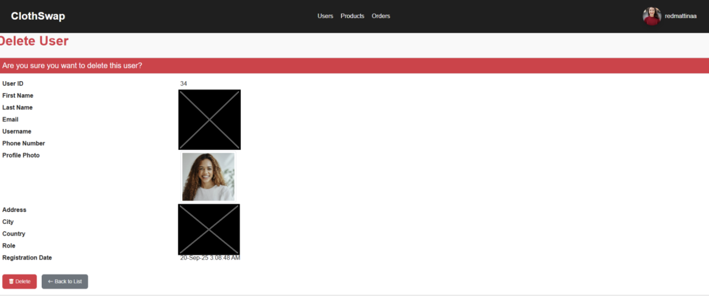
  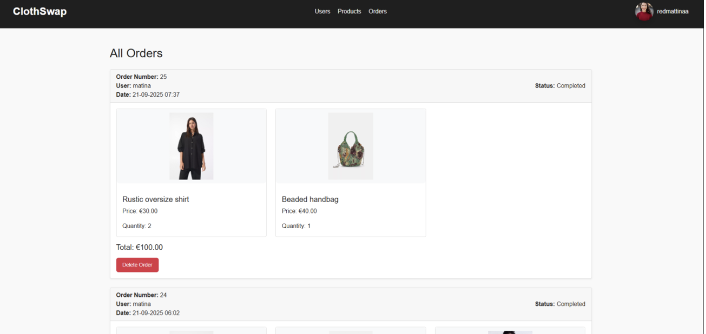
</p>

<p align="center">
  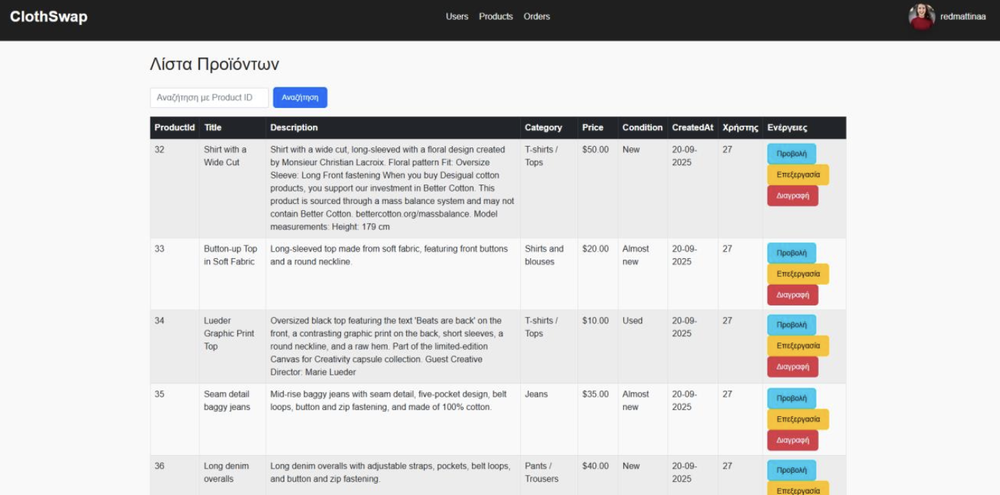
</p>

---

## 🚀 Installation & Setup

Follow the steps below to run the project locally:

### ✅ Prerequisites
- [.NET 8 SDK](https://dotnet.microsoft.com/en-us/download/dotnet/8.0)
- [SQL Server Express / LocalDB](https://www.microsoft.com/en-us/sql-server/sql-server-downloads)
- [EF Core CLI tools](https://learn.microsoft.com/en-us/ef/core/cli/dotnet): `dotnet tool install --global dotnet-ef`
- Optional: [Visual Studio 2022](https://visualstudio.microsoft.com/) with the **ASP.NET and web development** workload

### 1. Clone the repository
```bash
git clone https://github.com/matinapap/OnlineShopUniPi.git
cd OnlineShopUniPi/src/OnlineShopUniPi
```

### 2. Configure the connection string
The connection string is not stored in the repository. Set it with user secrets:
```bash
dotnet user-secrets set "ConnectionStrings:DefaultConnection" "Server=(localdb)\\MSSQLLocalDB;Database=OnlineStoreDB;Trusted_Connection=True;TrustServerCertificate=True;MultipleActiveResultSets=true"
```
Alternatively, create an `appsettings.Local.json` file next to `appsettings.json` (it is ignored by git).

### 3. Create the database
The database is created entirely by the EF Core migrations in `Migrations/`. From the `src/OnlineShopUniPi` folder, run:
```bash
dotnet ef database update
```
This creates the `OnlineStoreDB` database (the name in the connection string) and applies all migrations in order:

| Migration | What it does |
|---|---|
| `InitialSyncEmpty` | Creates the base tables of the original database |
| `AddProductCategoryRelation` | Links products to a `Categories` table |
| `AddGenderAndCategoryToProduct` | Replaces that link with `category` and `gender` columns and drops `Categories` |
| `AddQuantityAndSizeToProduct` | Adds `quantity` and `size` to products |
| `AddStatusToOrderItem` | Adds `status` to order items |
| `RemoveSellerReview` | Drops the unused `SellerReviews` table |

The result is the schema shown in the Database section above. To start over, run `dotnet ef database drop` and then `dotnet ef database update` again.

### 4. Run the application
```bash
dotnet run
```
Then open the URL shown in the terminal (by default `https://localhost:7203`).

---

## 📁 Project Structure

```
OnlineShopUniPi/
├── OnlineShopUniPi.sln
├── README.md
├── LICENSE
├── docs/
│   ├── UserManual.pdf
│   └── images/                # Database schema and README screenshots (guest_user, logged_in_user, admin)
└── src/
    └── OnlineShopUniPi/
        ├── Controllers/       # MVC controllers (Home, Products, Orders, Users)
        ├── Helpers/           # Session extension methods
        ├── Migrations/        # EF Core migrations (create the database from scratch)
        ├── Models/            # Entity classes, DbContext and validation metadata
        ├── Properties/        # Launch settings
        ├── Views/             # Razor views
        ├── wwwroot/           # Static files (CSS, JS, images, client libraries)
        ├── appsettings.json   # App settings (no secrets; connection string set via user secrets)
        └── Program.cs         # App configuration and middleware pipeline
```

---

## 🔮 Possible Improvements

- Use ASP.NET Core Identity's `PasswordHasher` (salted hashing) instead of plain SHA-256
- Move the recommendation logic from the controller into a dedicated service
- Add unit tests for the recommendation scoring

---

## 📚 Documentation
See the full [User Manual](./docs/UserManual.pdf) for step-by-step usage.

---

## ⚖️ License
This project is licensed under the [MIT License](./LICENSE).
